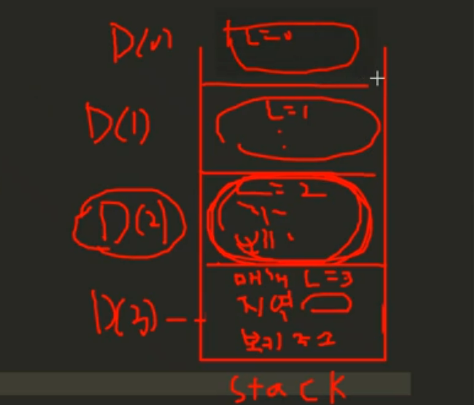

### 섹션

- 9. 재귀함수와 완전탐색(DFS:깊이우선탐색)

### 문제

자연수 N이 입력되면 재귀함수를 이용하여 1부터 N까지를 출력하는 프로그램을 작성하세요.

### 관련 지식

- **재귀함수**

  - 재귀함수가 돌아가는 원리는 스택이라는 자료구조를 쓴다.
  - 재귀함수가 호출될 때, 스택의 스택 프레임이라는 함수의 정보들이 저장돼서 어떻게 돌아가는지를 알아보자.

- **스택프레임**

  - DFS(3)의 매개변수, 지역변수, 복귀주소를 스택에 저장한다.
    - 복귀주소 : 일을 모두 마치면, 자신이 호출되었던 복귀주소로 되돌아가야한다.
  - 이를 DFS(3)의 스택프레임이라 한다.
  - 

    - DFS(3)의 스택프레임
      - 매개변수 : L=3
      - 복귀주소 :
    - DFS(2)의 스택프레임
      - 매개변수 : L=2
      - 복귀주소 : DFS(3)의 12라인
    - DFS(1)의 스택프레임
      - 매개변수 : L=1
      - 복귀주소 : DFS(2)의 12라인
    - DFS(0)의 스택프레임
      - 매개변수 : L=0
      - 복귀주소 : DFS(1)의 12라인
