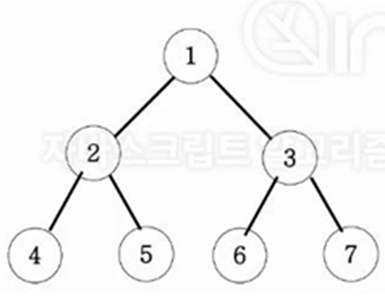

### 섹션

- 9. 재귀함수와 완전탐색(DFS:깊이우선탐색)

### 문제

아래 그림과 같은 이진트리를 전위순회와 후위순회를 연습해보세요.

### 관련 지식

**깊이우선탐색**

- 부모 : `x`
  - ex. 1, 3
- 왼쪽 자식 : `x * 2`
  - ex. 2, 6
- 오른쪽 자식 : `(x * 2) + 1`
  - ex. 3, 7

 

- 왼쪽부터 파고 들어간다.
- 더 이상 길이 없으면, 되돌아가고, 안가본 길을 간다.
- ex. `1 -> 2 -> 4 -> 5 -> 3 -> 6 -> 7`

 

- 부모가 중심
- **전위순회**
  - **부모 -> 왼쪽 -> 오른쪽**
  - ex. `1 -> 2 -> 4 -> 5 -> 3 -> 6 -> 7`
- **중위순회**
  - **왼쪽 -> 부모 -> 오른쪽**
  - ex. `4 -> 2 -> 5 -> 1 -> 6 -> 3 -> 7`
- **후위순회**

  - **왼쪽 -> 오른쪽 -> 부모**
  - ex. `4 -> 5 -> 2 -> 6 -> 7 -> 3 -> 1`

- (작성한 코드, 트리와 스택프레임 직접 그려보기)
