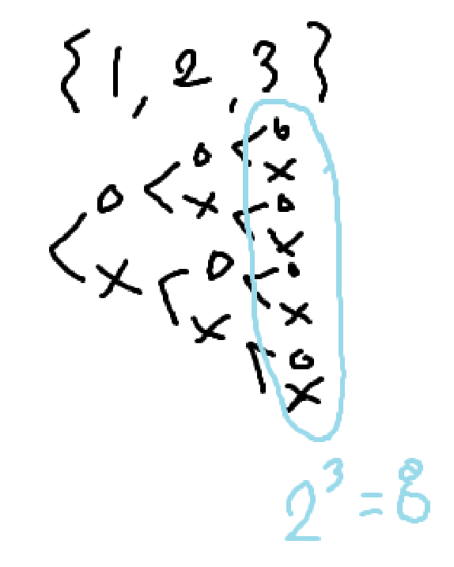

### 섹션

- 9. 재귀함수와 완전탐색(DFS:깊이우선탐색)

### 문제

자연수 N이 주어지면 1부터 N까지의 원소를 갖는 집합의 부분집합을 모두 출력하는 프로그램을 작성하세요.

단, 공집합은 출력하지 않습니다.

```
입력예제
3

출력예제
1 2 3
1 2
1 3
1
2 3
2
3
```

### 관련 지식H



- **부분집합에 참여한다(o)/참여안한다(x)** 로 구분될 수 있음
- **트리**로 표현이 됨.
