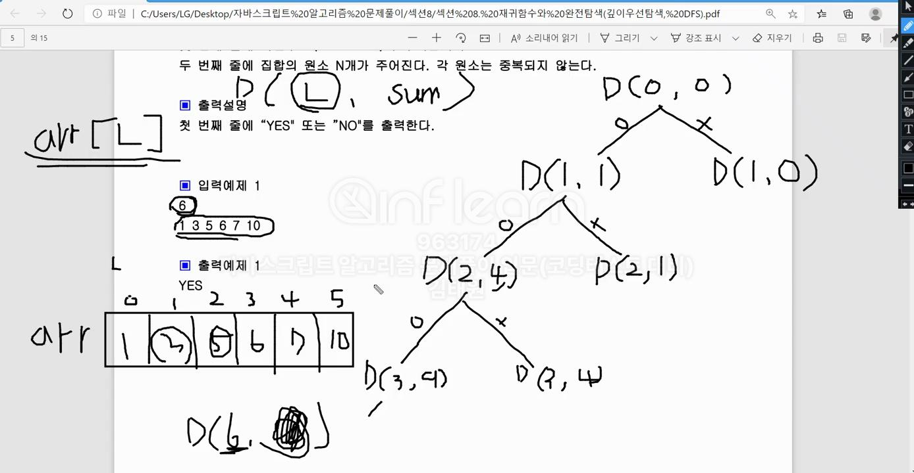

### 섹션

- 9. 재귀함수와 완전탐색(DFS:깊이우선탐색)

### 문제

N개의 원소로 구성된 자연수 집합이 주어지면, 이 집합을 두 개의 부분집합으로 나누었을 때 두 부분집합의 원소의 합이 서로 같은 경우가 존재하면 "YES"를 출력하고, 그렇지 않으면 "NO"를 출력하는 프로그램을 작성하세요.
둘로 나뉘는 두 부분집합은 서로소 집합이며, 두 부분집합을 합하면 입력으로 주어진 원래의 집합이 되어 합니다.
예를 들어 `{1, 3, 5, 6, 7, 10}`이 입력되면 `{1, 3, 5, 7} = {6, 10}` 으로 두 부분집합의 합이 16으로 같은 경우가 존재하는 것을 알 수 있다.

- 입력설명
  첫 번째 줄에 자연수 N(1<=N<=10)이 주어집니다.
  두 번째 줄에 집합의 원소 N개가 주어진다. 각 원소는 중복되지 않는다.

- 출력설명
  첫 번째 줄에 "YES" 또는 "NO"를 출력한다.

```
입력예제
6
1 3 5 6 7 10

출력예제
YES
```

### 관련 지식



- `D(L, sum)`

  - `L` : 포함/불포함 인덱스 번호
  - `sum` : 포함되는 값들을 더한 숫자

---

- `flag`
  - flag를 세워서, 더 이상 함수를 실행시킬 필요없을 때 종료하도록 설정

---

- arr.**reduce**
  - 누적 값 구하기
  - `arr.reduce((a,b) => a+b)`
    - arr배열 내의 모든 값을 더함
    - `ex. arr=[1,2,3] //6`
