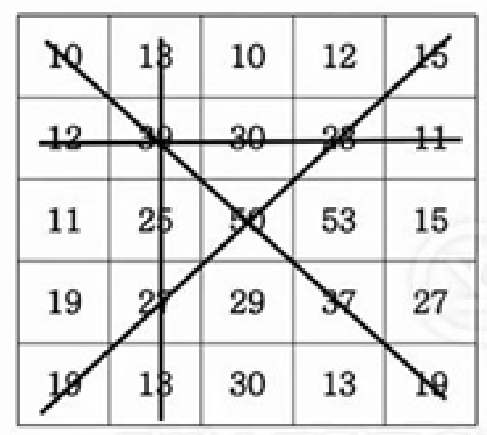

### 섹션

- 3. 1, 2차원 배열 탐색

### 문제

5x5 격자판에 아래와 같이 숫자가 적혀있습니다.



NxN의 격자판이 주어지면 각 행의 합, 각 열의 합, 두 대각선의 합 중 가장 큰 합을 출력합니다.

- 입력설명
  첫 줄에 자연수 N이 주어진다.(1<=N<=50)
  두 번째 줄부터 N줄에 걸쳐 각 줄에 N개의 자연수가 주어진다. 각 자연수는 100을 넘지 않는다.

- 출력설명
  최대합을 출력합니다.

```
입력예제
5
10 13 10 12 15
12 39 30 23 11
11 25 50 53 15
19 27 29 37 27
19 13 30 13 19

출력예제

```

### 관련 지식

- **Math.max(a, b, c)**
  - a, b, c 중 가장 큰 값을 return
  - 가장 큰 값을 구하는 메서드

---

- **slice(a, b)**

  - **a부터 b-1까지**
  - 얕은 복사본을 새로운 배열 객체로 반환
  - 원본 배열은 바뀌지 않는다.
  - [mdn문서\_slice](https://developer.mozilla.org/ko/docs/Web/JavaScript/Reference/Global_Objects/Array/slice)

---

- **splice(a, b, text)**

  - **a번째요소부터 b개 제거 & text를 a자리에 추가**
  - 배열의 기존 요소를 제거 & 삭제
  - 원본 배열 바뀜.

  ```
  const months = ["Jan", "March", "April", "June"];
  months.splice(1, 0, "Feb");
  console.log(months);
  // Array ["Jan", "Feb", "March", "April", "June"]

  months.splice(4, 1, "May");
  console.log(months);
  // Array ["Jan", "Feb", "March", "April", "May"]

  months.splice(4, 2, "May");
  console.log(months);
  // Array ["Jan", "Feb", "March", "April", "May"]

  months.splice(3, 2, "May");
  console.log(months);
  // Array ["Jan", "Feb", "March", "May"]
  ```

  - [mdn문서\_splice](https://developer.mozilla.org/ko/docs/Web/JavaScript/Reference/Global_Objects/Array/splice)

---
