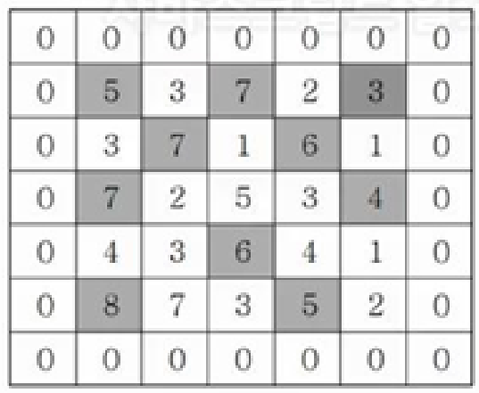

### 섹션

- 3. 1, 2차원 배열 탐색

### 문제

지도 정보가 NxN 격자판에 주어집니다. 각 격자에는 그 지역의 높이가 쓰여있습니다. 각 격자판의 숫자 중 자신의 상하좌우 숫자보다 큰 숫자는 봉우리 지역입니다. 봉우리 지역이 몇 개 있는 지 알아내는 프로그램을 작성하세요.
격자의 가장자리는 0으로 초기화 되었다고 가정한다.
만약 N=5 이고, 격자판의 숫자가 다음과 같다면 봉우리의 개수는 10개입니다.



- 입력설명
  첫 줄에 자연수 N이 주어진다.(1<=N<=50)
  두 번째 줄부터 N줄에 걸쳐 각 줄에 N개의 자연수가 주어진다. 각 자연수는 100을 넘지 않는다.

- 출력설명
  봉우리의 개수를 출력하세요.

```
입력예제
5
5 3 7 2 3
3 7 1 6 1
7 2 5 3 4
4 3 6 4 1
8 7 3 5 2

출력예제
10

```

### 관련 지식

- **행 좌표, 열 좌표**

  - `let dx = [-1, 0, 1, 0];`
  - `let dy = [0, 1, 0, -1];`
  - 행 좌표 **(nx) = i + dx[k]**
  - 열 좌표 **(ny) = j + dy[k]**
    - 행, 열 좌표 헷갈리지 않게 주의!!
    - ~~수학 (x,y)~~가 아님!!
    - **이중배열에서 nx번째 배열 내의 ny번째 요소임!!**
    - **ex. arr[1,2]; // 1** (~~수학좌표 1,2는 2임.~~ 즉, 2아님 주의!!)

- **break**

  - `for문`을 바로 빠져나올 때 `break`를 쓰면 됨.
  - ~~return~~이 아님!!

- **flag**

  - flag를 이용해 `flag = 0 (즉, flase)`일 때를 활용할 수 있다.
  - `flag = 1 (즉, true)`일 때를 활용.

---

- **배열 요소의 교체**

  - js는 swap을 지원하지 않아, 직접 코드 구현.
  - 임시값 temp 이용

    ```
    const arr1 = [1,2,3];
    const arr2 = [4,5,6];

    let temp = arr1[0];
    arr1[0] = arr2[0];
    arr2[0] = temp;

    console.log(arr1); // [4,2,3]
    console.log(arr2); // [1,5,6]
    ```

  - **존재하는 배열의 요소를 다른 값으로 교체하고 싶을 때**
    ```
    const arr = ["A", "B", "C"];
    arr[0] = "D";
    console.log(arr); // ["D", "B", "C"]
    ```

---

- **이중배열 생성 방법**
  ```
  let fullArr = Array.from({ length: N + 2 },
      () => Array.from({ length: N + 2 }, () => 0)
    );
  ```
  - 예시, 코드 확인!
