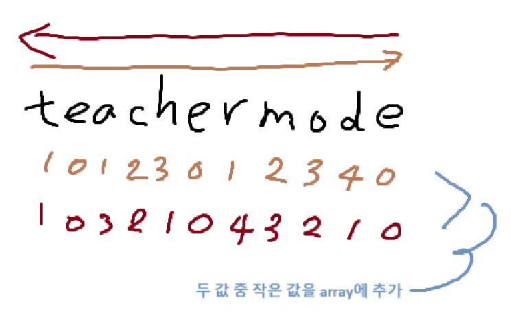

### 섹션

- 4. 문자열 탐색

### 문제

한 개의 문자열 s와 문자 t가 주어지면 문자열 s의 각 문자가 문자 t와 떨어진 최소거리를 출력하는 프로그램을 작성하세요.

- 입력설명
  첫 번째 줄에 문자열 s와 문자 t가 주어진다. 문자열과 문자는 소문자로만 주어집니다.
  문자열의 길이는 100을 넘지 않는다.

- 출력설명
  첫 번째 줄에 각 문자열 s의 각 문자가 문자 t와 떨어진 거리를 순서대로 출력한다.

```
입력예제
teachermode e

출력예제
1 0 1 2 1 0 1 2 2 1 0

```

### 관련 지식

- **Math.min(a,b)**

  - a, b 둘 중 작은 값 구하기

- **array.splice(i, n, "string")**
  - i번째 인덱스 부터 n만큼을 제거하고, string 추가

---

- 문제 팁

  

  - **왼쪽에서 오른쪽으로** e가 아닐 경우에, p++값 array에 push
  - **오른쪽에서 왼쪽으로** e가 아닐 경우에, p++값 array에 이미 들어있는 값과 **비교** 후 더 작으면 교체
  - (e일 경우는, p=0 값 array에 push)
